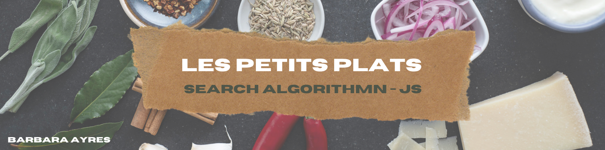

# Les Petits Plats - Development of a search algorithm in JavaScript

**Link : https://blayres.github.io/P7_ayres_barbara/**

<b>

================ FR ====================

</b>

Après avoir édité des livres de cuisine pendant plusieurs années, l’entreprise a décidé de se lancer dans un nouveau projet : réaliser son propre site de recettes de cuisine à l’instar de Marmiton ou 750g.

Nous disposons uniquement d’un fichier JavaScript contenant un tableau JSON de 50 recettes. 

## Cas d’utilisation :

Filtrer les recettes dans l’interface utilisateur.

## Objectif :

Accéder rapidement à une recette correspondant à un besoin de l’utilisateur dans les recettes déjà reçues.

## Description :

L’utilisateur doit pouvoir filtrer les recettes selon deux axes :

1. Une barre principale permettant de rechercher des mots ou groupes de lettres dans le titre, les ingrédients ou la description.
2. Recherche par mots clés dans les ingrédients, les ustensiles ou les appareils.

## On a fait 2 versions du code pour tester la performance du site :

- Une version utilisant les boucles natives (while, for...) 
- Et une version en programmation fonctionnelle avec les méthodes de l'objet array (foreach, filter, map, reduce).

 

<b>

================ EN ====================

</b>
  
After editing several cookbooks for years, a company has decided to jump into a new challeging project : developing their own website of cooking recipes (similar to [Marmiton](https://www.marmiton.org/) or [750g](https://www.750g.com/)).

For executing this project, the only base document is a JavaScript file with a table in JASON of 50 recipes.

## Use Case:

Filter recipes in the UI.

## Objective:

Quickly access a recipe corresponding to a need of the user in the already existing receipts.

## Description:

The user must have the possibility of filtering the recipes according to two conditions:

1. A main bar which allows searching for words or phrases in the title, ingredients or description;
2. Search for key words contained in the ingredients, cooking tools or kitchen appliances.

## We've made 2 versions of the code in order to test the website performance: 

- A version using native loops (while, for...).
- And a functional programming version with the methods of the array object (foreach, filter, map, reduce).
